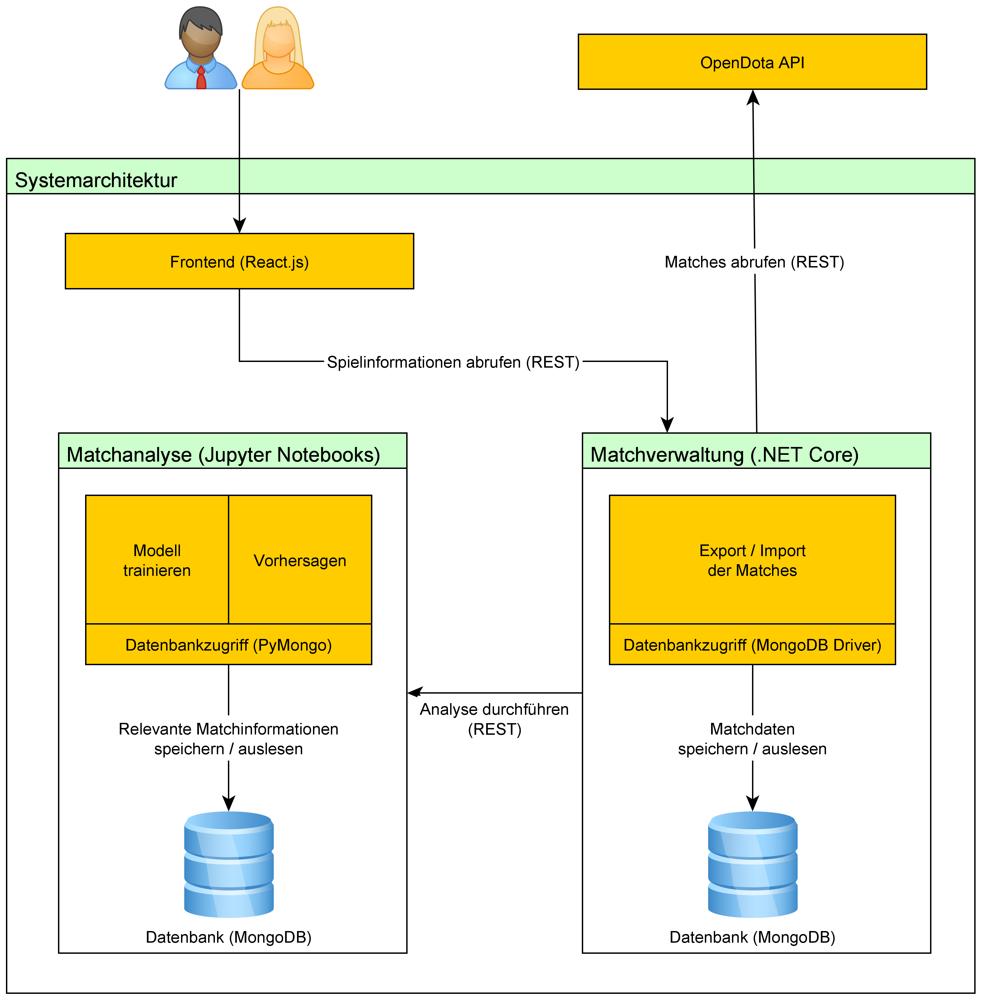

# BDCC Projekt Modularbeit

# Architektur


# Zeitschätzung
1. Setup 20% 1W
- Anlegen des Projektes (ASP.NET Core Backend, Datenbank) 80%
- Struktur des (Python?) KI Bereiches abklären 20%

2. Aufgabenverteilung 80% 4W
- KI-Bereich (Gegebene Daten entsprechend verarbeiten und Vorhersagen treffen) 35%
- Backend-Bereich (Datenaggregation von OpenDota, Speichern in Datenbank, Aufbereitung) 35%
- Kommunikation zwischen Backend und KI 20%
- Frontend 10%

## Vorraussetzungen

Docker

- https://www.docker.com/products/docker-desktop

(Beispielsweise) Visual Studio 2019 + DotNet 5.0, Community Edition reicht.

## Start der Anwendung

Nach dem Start von Docker kann mithilfe des folgenden Befehls innerhalb des Verzeichnisses /src/ das System gestartet werden. Der initiale Start benötigt mit erstmaligen Download der Images einige Zeit (ca. 3 Minuten oder deutlich mehr, abhängig von der Performance des Systems), da viele Pakete erst heruntergeladen und automatisch konfiguriert werden müssen.

Zum Start des Systems im Verzeichnis der 'docker-compose.yml' auszuführen:

```
docker-compose down && docker-compose build && docker-compose up
```

## Komponenten

Die Konfiguration der einzelnen Komponenten und der dazugehörigen Docker Images ist in der Datei **docker-compose.yml** möglich.
Das System ist in mehrere Komponenten aufgeteilt. Dabei wurden einige Docker Images erweitert und befinden sich im Ordner **/images** :

### Frontend

Das Frontend ist aufrufbar unter:

Aufruf:
- http://localhost:3000/

### Matchanalyse (jupyter-notebooks)
Stellt einen Jupyter-Server zur Verfügung, mit dem die in diesem Projekt durchgeführten Analysen eingesehen werden können.

Aufruf:
- http://localhost:8888/

### Matchanalyse (jupyter-notebooks-server)
Stellt einen Jupyter-Server zur Verfügung, der als API konfiguriert worden ist. Dadurch ist es möglich, mithilfe eines Jupyter-Notebooks auf Datensätze zugreifen zu können. Die Algorithmen der in *jupyter-notebooks* erstellten Notebooks können dadurch wiederverwendet und für weitere Komponenten integriert werden.

Anfragen an die API werden dabei an

- http://localhost:8898/

gesendet.

### Matchverwaltung (.NET Core)

- http://localhost/swagger/index.html

### MongoDB

Verbindung aufbauen mit:

MongoDB-Backend
- mongodb://127.0.0.1:27017

MongoDB-KI
- mongodb://127.0.0.1:27018

Beispielsweise mit dem Tool: MongoDB Compass

Export der Daten aus einer MongoDB Datenbank:
```mongodump --host="127.0.0.1" --port=27017 --gzip --forceTableScan -d Data-KI -o ./seeds```

Import der Daten in eine MongoDB (Automatisch mithilfe der mongo-seeder Images):
```mongorestore --host 127.0.0.1 --drop --gzip --dir ./seeds```

### mongo-seeder
Zuständig für die initiale Befüllung der Datenbank (MongoDB) mit Daten.

### mongodb-init-replica-set

Mithilfe der Scripts in /src/deployment_scripts/ findet die Initiierung der MongoDB Replica Sets statt.

### Extern:

Gitignore:

- https://github.com/toptal/gitignore/blob/master/templates/JupyterNotebooks.gitignore
- https://gist.github.com/takekazuomi/10955889
- https://stackoverflow.com/a/57293443